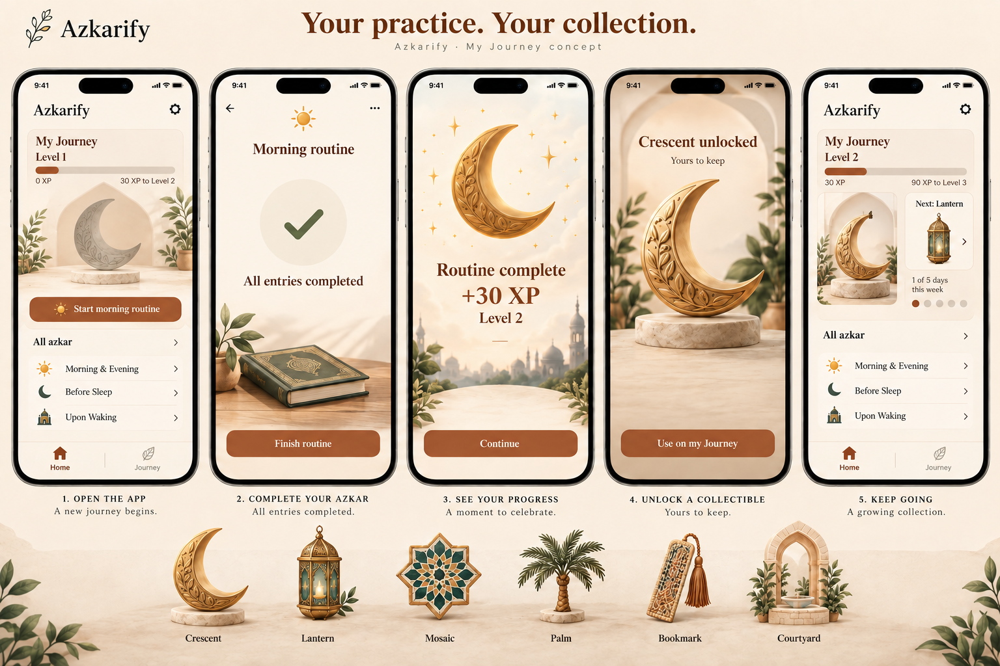

# Azkarify visual and sound direction

Concept proposal, 29 September 2026. Companion to [the gamification plan](../gamification-plan.md).

## Recommended art direction

Use warm illustrated keepsakes. Cream surfaces, terracotta controls, muted sage, and small gold details fit the existing app. Collectibles should feel like objects someone would want to keep: an engraved crescent, glass lantern, mosaic tile, palm, woven bookmark, and courtyard arch.

The first visual board shows the first-session journey. It explores artwork and composition; the native implementation retains the app's actual fonts, search, accessible controls, and content. Do not copy decorative text or approximate progress-bar lengths from a generated image into production.

The two completion and reveal panels are states within one dismissible completion sheet. They do not require the user to pass through two full-screen interruptions. Allow Done immediately, and expose Use on my Journey when an item unlocks.

## Where graphics belong

| Place | Graphic | Behavior |
| --- | --- | --- |
| Home Journey card | One featured collectible, approximately 64–88 points tall | Static by default; keep the library and search easy to reach |
| Routine reader | Small progress indicator and completion check | The azkar text gets the space; no scenery behind reading text |
| Routine completion | Checkmark and XP update | One brief confirmation; no looping celebration |
| Collectible reveal | Larger artwork, approximately 160–220 points tall | Brief scale and settling motion, then still |
| Collection album | Consistent thumbnails and locked silhouettes | Every item has a label and exact unlock threshold |
| Weekly goal | Seven dated marks and five-day goal status | A completed week gets a short acknowledgement; no separate reward currency |
| Return after a break | Previously featured collectible | Nothing wilts, breaks, disappears, or needs repair |

Use an illustration's silhouette as its locked state, not a blurred image that makes the reward hard to understand. Feature one object on Home. Keep the first release's album a simple grid; a scene-placement editor remains a later option.

The current board is an English composition study. Produce a right-to-left layout with the existing Arabic font choices before implementation. Artwork itself usually does not need mirroring; navigation, text, and directional progress do.

## The motion sequence

A completed routine first saves successfully. Then one completion sheet shows all the awards from that action.

| Time after success | Visible action | Feedback |
| --- | --- | --- |
| 0–150 ms | Completion check appears | One light success haptic if enabled |
| 150–500 ms | XP total updates to its final value | Select one sound using the priority rule below |
| 300–850 ms, if unlocked | Collectible enters at 92% scale, settles at 100% | At most a few short sparkles around the object |
| By 1,000 ms | Result is static with Done and optional Use on my Journey | No further sounds or automatic navigation |

These timings are proposed values, not measured performance. Do not delay buttons until the animation ends. Reduce Motion replaces movement and particles with an immediate static result. VoiceOver receives one combined summary such as “Routine complete. 30 XP earned. Level 2. Crescent unlocked.” Avoid competing sound effects during that announcement.

A weekly bonus uses the same sheet. For example, show “30 routine XP + 50 weekly XP” and the final total. If it also unlocks a level, combine the information rather than opening another sheet.

## Sound sketches

These are original synthesized previews, not recorded instruments or mastered release assets. They are mono PCM WAV files at 48 kHz and 16 bit. The generator is included so pitch, decay, and timing can be revised.

| Event | Direction | Duration | Preview |
| --- | --- | ---: | --- |
| Routine complete | Two soft wooden taps with a gentle upward change | 0.46 seconds | [Listen](sounds/routine-complete.wav) |
| Collectible unlocked | Two light glass-like tones | 0.82 seconds | [Listen](sounds/collectible-unlock.wav) |
| Level up | A short rising three-tone cue | 1.08 seconds | [Listen](sounds/level-up.wav) |

The routine cue is the most restrained option. For users who want no pitched reward tones, offer the wooden cue for all completions, with visual changes providing the distinction.

## Playback rules

- Play at most one effect for a completion: collectible unlock takes priority over level up, which takes priority over ordinary routine completion.
- A weekly goal uses the ordinary completion cue unless that same action unlocks a level or collectible. It does not introduce a fourth sound.
- Do not play reward sounds for every counter tap, list swipe, launch, resumed screen, or repeated rendering of a saved receipt.
- Sounds are optional and follow the device's silent setting. Keep a separate haptics control. Provide an explicit preview in settings and no background soundtrack.
- Treat effects as nonessential audio. Do not stop another app's audio or mix effects over recitation playback. If recitation is added later, defer or omit the effect.
- Play only after the completion transaction saves. A retry, offline reopen, or failed save must not play success twice.
- Deduplicate feedback by completion receipt ID. Record whether that receipt's celebration was presented, separately from whether the XP award exists.
- Never play a failure buzzer for a missed day or incomplete routine.

Apple's audio guidance distinguishes nonessential sound effects from deliberate media playback and discusses silent-mode and mixing behavior. Validate the final native audio session on a physical iPhone, including the Ring/Silent setting, headphones, another app playing audio, and VoiceOver. [Apple: Playing audio](https://developer.apple.com/design/human-interface-guidelines/playing-audio).

## Assets to produce for the first release

1. Nine final reward illustrations matching the XP catalog, plus a neutral starter illustration. Supply transparent images at suitable 1x, 2x, and 3x sizes after defining their maximum rendered size.
2. Locked silhouettes, generated from the approved illustrations with a consistent presentation.
3. A small reusable sparkle effect and a completion check. These can be native animation and SF Symbols rather than additional image files.
4. Three final audio assets based on the sketches, balanced together on phone speakers and headphones. The sketches peak at approximately -14.4 to -14.9 dBFS with no digital clipping; this does not establish perceived loudness or device playback quality.
5. English and Arabic layouts for Home, routine completion, the album, an unlocked item, the weekly goal, and returning after inactivity.

The concept board is not a sprite sheet. Generate the approved collectibles individually with transparent backgrounds before integrating them into the app. Do not crop tiny thumbnails out of the board as final assets.

## Verification and provenance

The board was generated with the built-in image-generation tool, then edited to correct XP copy and remove invented reading content. The selected board is `journey-concept-v1.png`. The original generated files remain untouched.

The WAV generator checks amplitude and reports duration, peak, and RMS. The three WAV files were structurally inspected. Subjective listening and physical-device sound balancing remain part of production review. No app code or audio behavior was changed.

Final image edit prompt:

> Edit this Azkarify journey design board to correct UI copy and remove invented content while keeping the five-screen composition and beautiful cream terracotta tactile collectible art. IMPORTANT first screen currently incorrectly says '100 XP to Level 2': change to exactly '30 XP to Level 2'. Second screen remove ALL six invented virtue labels Gratitude Protection Guidance Contentment Ease Good character and the '6 of 6' count; replace that checklist area with a clean large checkmark and exact text 'All entries completed'. Do not invent religious content or numeric content counts anywhere. On first and fifth screen replace library rows with exactly 'Morning & Evening', 'Before Sleep', 'Upon Waking', no entry counts, no other categories. Remove ALL moral or spiritual slogans and descriptions: delete 'A more mindful tomorrow', 'A brighter you', 'Closer to what matters', 'A beautiful journey ahead in shaa Allah', 'Small moments Lasting good', 'Consistent good leads to a brighter tomorrow', 'A symbol of new beginnings and a more mindful you', 'Collect beautiful reminders', 'Same better tomorrows', all descriptive virtue meanings under bottom collectibles. Instead use minimal neutral UI labels only. Top title 'Your practice. Your collection.' and smaller 'Azkarify · My Journey concept'. On screen3 show 'Routine complete', '+30 XP', 'Level 2', and button 'Continue'. On screen4 'Crescent unlocked', 'Yours to keep', 'Use on my Journey'. Screen5 keep correct 'Level 2', '30 XP', '90 XP to Level 3', 'Next: Lantern', '1 of 5 days this week'. Bottom art sample row labels only Crescent, Lantern, Mosaic, Palm, Bookmark, Courtyard. Keep art and typography beautifully crafted. Remove extra new navigation tabs, use small Home and Journey navigation only. This is a product design concept, not spiritual guidance.
